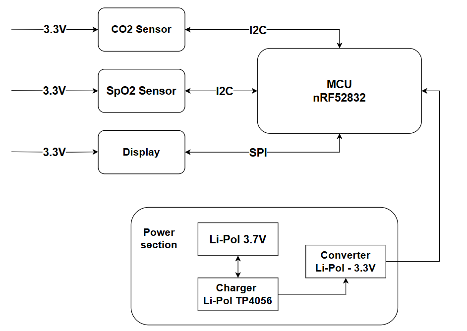

# SpO2_CO2

The repository contains a description of the implementation of a device that allows to monitor the blood oxygenation level and the content of carbon dioxide in the exhaled air.

The device is equipped with a display that allows to visualize the sensor data and buttons responsible for initializing the measurements.

The project was implemented using a module equipped with a nRF52832 microcontroller. The software was based on the Zephyr real-time operating system.

The device is equipped with a button that allows it to be turned on or off, thanks to which the system does not remain in standby mode and does not consume energy.

The MAX30102 sensor was used to measure blood saturation, which required calibration using the linear regression method for proper operation.

The STC-31 sensor was used to measure the level of carbon dioxide content. The sensors are configured using the I2C protocol.

The SPI communication interface was used to communicate with the SSD1306 display.

A printed circuit board and housing were designed and manufactured for the device.

